# bc-grammar

## Grammar and interpretter for [bc](https://www.gnu.org/software/bc/manual/html_mono/bc.html)

## How to run
`antlr4 Calculator.g4`

`javac *.java`

`java CalculatorRun input/<input file>`  (if no file name is provided, it will read input from the standard input stream)

The start rule is `prog`

## Features
* Scoping
  * Functions, loops, if-statements, and code blocks ({}) each have their own scopes
* Comments: both block `/* ... */` and line `//` comments
* Arithmetic expressions: addition (+), subtraction(-), multiplication(*), division(/), exponent(^), modulo(%)
* Arithmetic expressions with integers and doubles
* Arithmetic expressions with variables
* Boolean Expressions (!, &&, ||)
* Precedence (handles unary minus)
* Special Expression: read and sqrt
* print: prints expression followed by print i.g `print 1, 2, 3` output 123
* Math library functions: s, c, l, e 
* Relational Expressions (i.g >, >=, <, <=, ==)
* Function declaration
* Function call
* If-statements
* For loops
* While loops

Note: read() only accepts integers or doubles

## Scoping

CalcGlobalScope object is created at start of parsing and its parent is set to null.
For every new block statement, for loop, if statement, and while loop, a new FuncLocalScope object is created and the currentscope is temporarily set to this new scope. 

The scope is restored to previous scope upon exiting current scope. For function delcaration, scoping works similarly. In addition to symbol table that maps variable names to its values, a CalcFunctionScope object stores its function parameters and statement context so that they can be executed during function calls.

In a function call visitor method, the current scope will be checked to find a function scope that matches the function name. If found, current scope is set to this function call, and using the arguments, the parameter variable names saved previously are mapped to the argument values. Code is executed and any new variables and scopes are added to the current function scope.

Upon exiting function, scope is restore to previous scope.

Only global variables and are visible in the functions along with their own local scopes.

# bc-interpreter
